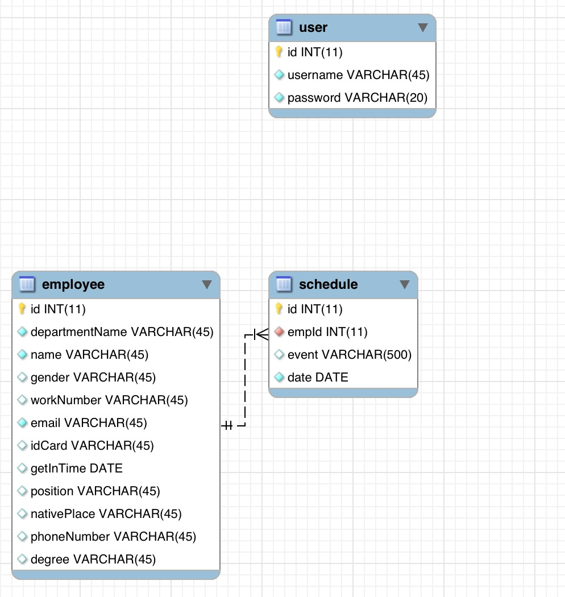

2017FCS3380
FINAL PROJECT

# Team members
    1. JIANAN NI
    2. HAO DING

# Description of Application
The project is mainly a staff management system for assigning tasks to employees. The main functions are as follows:
1. Administrator login
2. Employee data CRUD
3 staff assignment
4. Send email to staff to remind staff

# Schema
## employee
Column | Type | Constraint
---|---|---
id | INT(11) | PRIMARY KEY
departmentName | VARCHAR(45) | NOT NULL
name | VARCHAR(45) | NOT NULL
gender | VARCHAR(45) |
email | VARCHAR(45) | NOT NULL
idCard | VARCHAR(45) |
getInTime | DATE |
position | VARCHAR(45) |
nativePlace | VARCHAR(45) |
phoneNumber | VARCHAR(45) |
degree | VARCHAR(45) |

## schedule
Column | Type | Constraint
---|---|---
id | INT(11) | PRIMARY KEY
empId | INT(11) | FOREIGN KEY
event | VARCHAR(500) | NOT NULL
date | DATE | NOT NULL

## user
Column | Type | Constraint
---|---|---
id | INT(11) | PRIMARY KEY
username | VARCHAR(45) | NOT NULL
password | VARCHAR(45) | NOT NULL

# Entity Relationship Diagram

